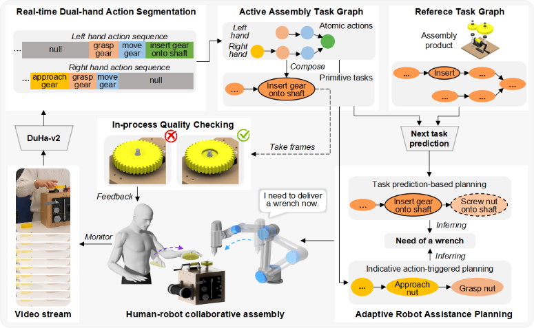
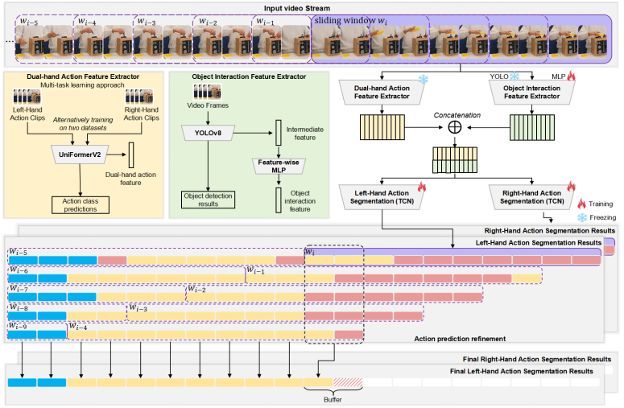

# A-human-robot-collaborative-assembly-framework-with-quality-checking
This is the repository for the paper "A human-robot collaborative assembly framework with quality checking based on real-time dual-hand action segmentation".

## Abstract
This paper presents a human-robot collaborative assembly (HRCA) framework, addressing key challenges in real-time dual-hand action understanding, adaptive robot assistance, and in-process quality checking. At its core is DuHa-v2, a real-time dual-hand action segmentation algorithm that efficiently segments assembly actions of two hands by integrating object interaction and action features. DuHa-v2 enables robots to proactively assist human workers by utilising either next-task prediction or indicative action recognition, both informed by the segmented action sequences. An in-process quality checking mechanism is proposed to ensure high assembly quality and efficiency by identifying errors immediately after critical assembly steps. The framework's effectiveness is validated through experiments on both the HA-ViD dataset and a real-world case study, demonstrating superior dual-hand action segmentation performance, timely robot assistance, and effective quality checking. The proposed HRCA framework enables robots to collaborate with humans in a more intuitive and reliable way by providing timely assistance, whether or not the overall task is known, and performing in-time assembly quality checks.



*The overall framework of human-robot collaborative assembly with quality checking.*

This framework consists of three key components, which represent the main contributions:
- *Real-time dual-hand action segmentation*: The proposed DuHa-v2 is employed for real-time dual-hand action segmentation, which processes video streams to generate atomic action sequences for both hands. These sequences are subsequently used to build a graph structure, from which a primitive task graph is inferred, collectively forming an active task graph (ATG) that represents the assembly process. The Human-Robot Shared Assembly Taxonomy (HR-SAT) [36], a structured assembly process representation method, is used to define the atomic actions and primitive tasks.

- *Adaptive robot assistance planning*: Based on the ATG and the reference task graph (RTG), which define the overall task precedence for product assembly, the task progress and subsequent tasks can be inferred. This enables the inference of the required tool for the upcoming task. Alternatively, by observing the current action, the tool needed in the near future can be anticipated. This adaptive approach enables the robot to proactively plan assistance, with or without the prior knowledge of the overall task.

- *In-process quality checking*: Based on the ATG, once a key primitive task is completed, visual quality checking is conducted over several subsequent frames using a binary classification neural network. If a visual defect is detected, immediate feedback is provided to the worker for timely correction.

## DuHa-v2: a real-time dual-hand action segmentation method
The proposed DuHa-v2 is the core contribution of this work, which provides the foundation for later adaptive robot assistance planning and in-process quality checking. This repository contains the necessary data and code to replicate DuHa-v2.



*Overview of DuHa-v2 for real-time dual-hand action segmentation.*

### Data preparation
The data is hosted in [Dropbox](https://www.dropbox.com/scl/fo/ura9rs952qploe73kyrk3/h?rlkey=9xl2ur3iojl69x1oay9ko2xuo&dl=0). We created the dataset by selecting a sub-dataset from [HA-ViD](https://iai-hrc.github.io/ha-vid). In this repository, we only provide the features and labels that are necessary to replicate DuHa-v2. More information about the dataset **HA-ViD** can be found at the [website](https://iai-hrc.github.io/ha-vid).
You should download the data and put it in a folder `./data`. 
The structure of `data` should look like:
```
data
├── train_features
├── train_edge_indices
├── train_i3d_features
├── train_lh_labels
├── train_rh_labels
├── test_features
├── test_edge_indices
├── test_i3d_features
├── test_lh_labels
├── test_rh_labels
```
### Environment preparation
We provide the `environment.yml` file to help you set up the environment easily. Please change the `prefix` to your anaconda location.
* run `conda env create -f environment.yml`

### Training and testing DuHa
To simplify the process, we use one script `main.py` to automatically train and test DuHa. We test DuHa after each epoch. In the HA-ViD, the videos have `front`, `side` and `top` views, are denoted as `M0` `S1` and `S2` respectively. To run the script `main.py`, please specify the `view` and `data_root` where you hold the data.
* run `python main.py --view M0 --data_root ./data/`

### Check logs
The log files will be save in `./log` dictionary. It contains dual-hand action segmentation accuracy of each epoch. 

## Demo
A demo video to show the adapative robot assistance planning.


## Citation
If you find our code useful, please cite our paper. 
```
@inproceedings{
  author    = {Hao Zheng and
               Wanqing Xia and 
               Xun Xu},
  title     = {A human-robot collaborative assembly framework with quality checking based on real-time dual-hand action segmentation},
  journal = {}
}
```

## Contact
If you have any question about this work, please contact Hao Zheng via [email](mailto:h.zheng.work@gmail.com).
